<div align="center">
  <a href="https://imswarnil.com"><picture><source media="(prefers-color-scheme: dark)" srcset="assets/header-dark.svg"><source media="(prefers-color-scheme: light)" srcset="assets/header-light.svg">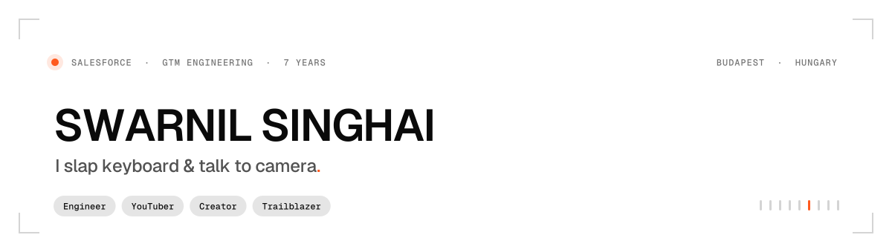</picture></a>
</div>

<p align="center">
  <a href="https://imswarnil.com"><picture><source media="(prefers-color-scheme: dark)" srcset="assets/social-site-dark.svg"><source media="(prefers-color-scheme: light)" srcset="assets/social-site-light.svg"></picture></a>
  <a href="https://x.com/imswarnil"><picture><source media="(prefers-color-scheme: dark)" srcset="assets/social-x-dark.svg"><source media="(prefers-color-scheme: light)" srcset="assets/social-x-light.svg"></picture></a>
  <a href="https://github.com/imswarnil"><picture><source media="(prefers-color-scheme: dark)" srcset="assets/social-github-dark.svg"><source media="(prefers-color-scheme: light)" srcset="assets/social-github-light.svg"></picture></a>
  <a href="mailto:swarnilsinghaicse@gmail.com"><picture><source media="(prefers-color-scheme: dark)" srcset="assets/social-email-dark.svg"><source media="(prefers-color-scheme: light)" srcset="assets/social-email-light.svg"></picture></a>
  <a href="https://imswarnil.github.io"><picture><source media="(prefers-color-scheme: dark)" srcset="assets/social-index-dark.svg"><source media="(prefers-color-scheme: light)" srcset="assets/social-index-light.svg"></picture></a>
</p>

Salesforce engineer, seven years deep in go-to-market: pipeline, funnel, CPQ, forecasting
and product-usage data turned into dashboards people actually open. Off the clock I build
one corner of the internet end to end — the site, the theme it runs on, the design system
under the theme, and the courses on top.

```
now      Salesforce Engineer @ Education First · Budapest, Hungary
before   Twilio · Cognizant · Accenture — GTM analytics, CRM Analytics, CPQ
making   a Salesforce teaching platform, two design systems, a paid Ghost theme
rule     tokens are the source of truth; nothing ships with a dependency it didn't need
```

## Currently building

<table>
  <tr>
    <td width="50%">
      <a href="https://github.com/imswarnil/Namaste-Salesforce"><picture><source media="(prefers-color-scheme: dark)" srcset="assets/proj-namaste-dark.svg"><source media="(prefers-color-scheme: light)" srcset="assets/proj-namaste-light.svg">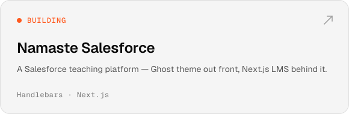</picture></a>
    </td>
    <td width="50%">
      <a href="https://github.com/imswarnil/NSDS-Design-System"><picture><source media="(prefers-color-scheme: dark)" srcset="assets/proj-nsds-dark.svg"><source media="(prefers-color-scheme: light)" srcset="assets/proj-nsds-light.svg">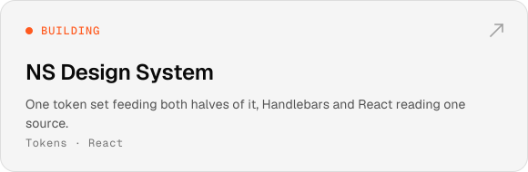</picture></a>
    </td>
  </tr>
  <tr>
    <td width="50%">
      <a href="https://github.com/imswarnil/Swarnil-Ghost-Theme"><picture><source media="(prefers-color-scheme: dark)" srcset="assets/proj-ghosttheme-dark.svg"><source media="(prefers-color-scheme: light)" srcset="assets/proj-ghosttheme-light.svg">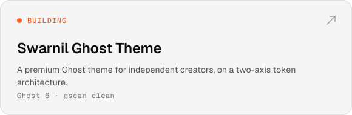</picture></a>
    </td>
    <td width="50%">
      <a href="https://github.com/imswarnil"><picture><source media="(prefers-color-scheme: dark)" srcset="assets/proj-sponsor-dark.svg"><source media="(prefers-color-scheme: light)" srcset="assets/proj-sponsor-light.svg">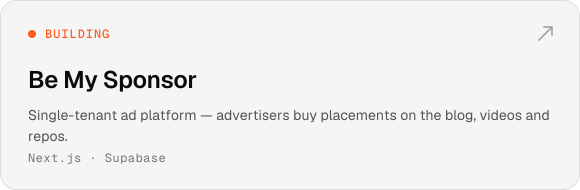</picture></a>
    </td>
  </tr>
  <tr>
    <td width="50%">
      <a href="https://github.com/imswarnil/Invite-Only-Onboarding-Portal"><picture><source media="(prefers-color-scheme: dark)" srcset="assets/proj-onboarding-dark.svg"><source media="(prefers-color-scheme: light)" srcset="assets/proj-onboarding-light.svg">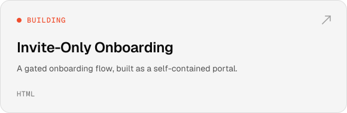</picture></a>
    </td>
    <td width="50%"></td>
  </tr>
</table>

## Live

<table>
  <tr>
    <td width="50%">
      <a href="https://imswarnil.com"><picture><source media="(prefers-color-scheme: dark)" srcset="assets/proj-hub-dark.svg"><source media="(prefers-color-scheme: light)" srcset="assets/proj-hub-light.svg">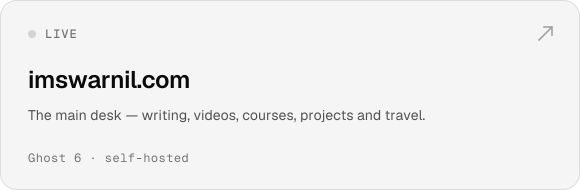</picture></a>
    </td>
    <td width="50%">
      <a href="https://design.imswarnil.com"><picture><source media="(prefers-color-scheme: dark)" srcset="assets/proj-fands-dark.svg"><source media="(prefers-color-scheme: light)" srcset="assets/proj-fands-light.svg">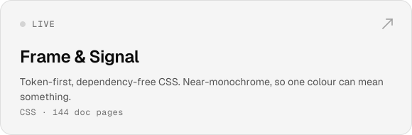</picture></a>
    </td>
  </tr>
  <tr>
    <td width="50%">
      <a href="https://crmanalytics.imswarnil.com"><picture><source media="(prefers-color-scheme: dark)" srcset="assets/proj-crma-dark.svg"><source media="(prefers-color-scheme: light)" srcset="assets/proj-crma-light.svg">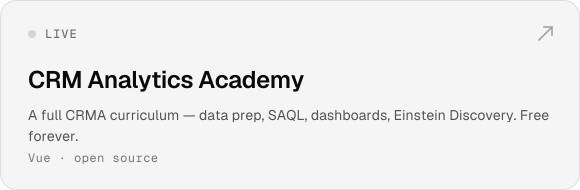</picture></a>
    </td>
    <td width="50%">
      <a href="https://trailblazer.imswarnil.com"><picture><source media="(prefers-color-scheme: dark)" srcset="assets/proj-trailblazer-dark.svg"><source media="(prefers-color-scheme: light)" srcset="assets/proj-trailblazer-light.svg">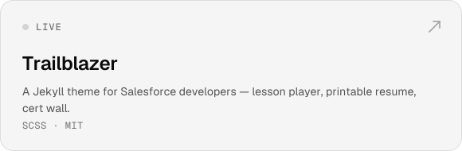</picture></a>
    </td>
  </tr>
  <tr>
    <td width="50%">
      <a href="https://imswarnil.github.io"><picture><source media="(prefers-color-scheme: dark)" srcset="assets/proj-index-dark.svg"><source media="(prefers-color-scheme: light)" srcset="assets/proj-index-light.svg">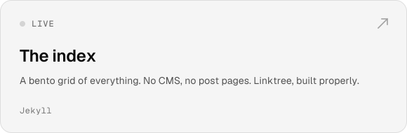</picture></a>
    </td>
    <td width="50%">
      <a href="https://jobseekers.imswarnil.com"><picture><source media="(prefers-color-scheme: dark)" srcset="assets/proj-jobs-dark.svg"><source media="(prefers-color-scheme: light)" srcset="assets/proj-jobs-light.svg">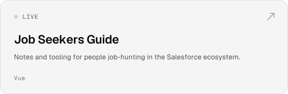</picture></a>
    </td>
  </tr>
  <tr>
    <td width="50%">
      <a href="https://salesforce.imswarnil.com"><picture><source media="(prefers-color-scheme: dark)" srcset="assets/proj-psk-dark.svg"><source media="(prefers-color-scheme: light)" srcset="assets/proj-psk-light.svg">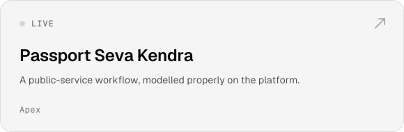</picture></a>
    </td>
    <td width="50%">
      <a href="https://github.com/imswarnil/No-AI-Content"><picture><source media="(prefers-color-scheme: dark)" srcset="assets/proj-noai-dark.svg"><source media="(prefers-color-scheme: light)" srcset="assets/proj-noai-light.svg">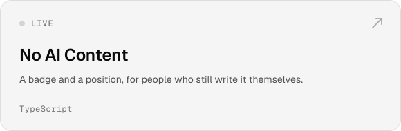</picture></a>
    </td>
  </tr>
</table>

## Experience

<div align="center"><picture><source media="(prefers-color-scheme: dark)" srcset="assets/experience-dark.svg"><source media="(prefers-color-scheme: light)" srcset="assets/experience-light.svg">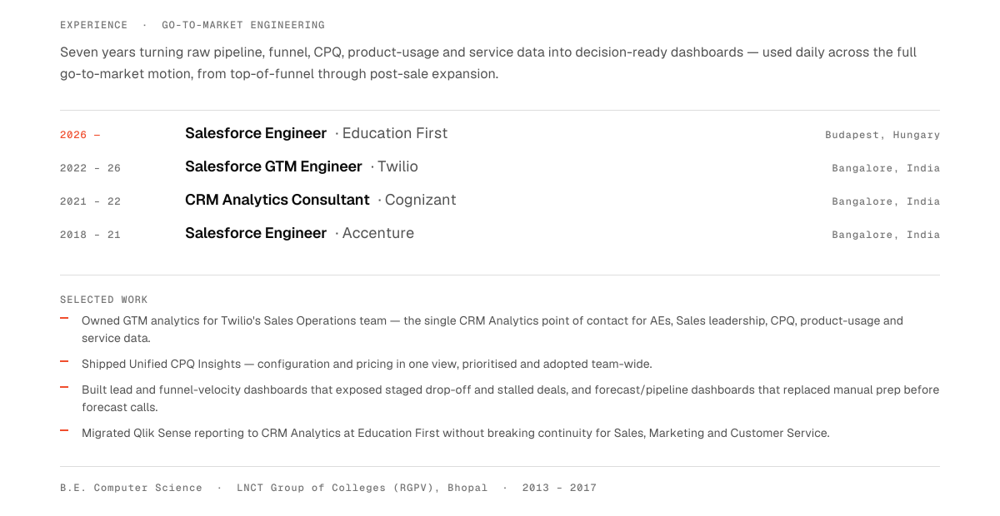</picture></div>

## Skills

<div align="center"><picture><source media="(prefers-color-scheme: dark)" srcset="assets/skills-dark.svg"><source media="(prefers-color-scheme: light)" srcset="assets/skills-light.svg">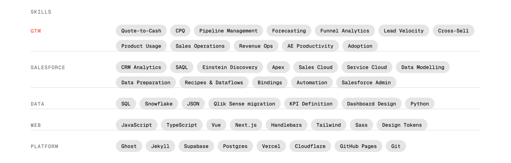</picture></div>

## The numbers

<div align="center"><picture><source media="(prefers-color-scheme: dark)" srcset="assets/stats-dark.svg"><source media="(prefers-color-scheme: light)" srcset="assets/stats-light.svg">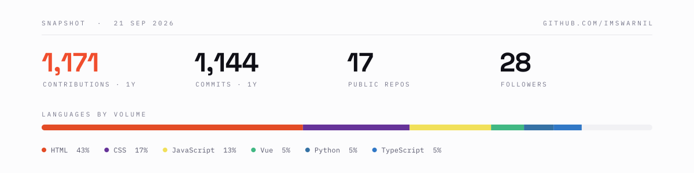</picture></div>

<sub>Not a third-party widget. <a href="scripts/render.py"><code>scripts/render.py</code></a>
draws every card on this page from the GitHub API in
<a href="https://design.imswarnil.com">Frame &amp; Signal</a>, converting the type to
outlines so it renders the same everywhere. Same rule as the rest: no dependency it
didn't need.</sub>

## Sponsor

The Salesforce material — [CRM Analytics Academy](https://crmanalytics.imswarnil.com),
[Trailblazer](https://trailblazer.imswarnil.com),
[Job Seekers Guide](https://jobseekers.imswarnil.com) — is free and stays free.
If it saved you a week, you can pay for a week of it.

[](https://github.com/sponsors/imswarnil)

---

<div align="center">
  <sub>
    <a href="https://imswarnil.com">imswarnil.com</a> ·
    <a href="https://imswarnil.github.io">the index</a> ·
    <a href="https://design.imswarnil.com">Frame &amp; Signal</a> ·
    <a href="https://x.com/imswarnil">@imswarnil</a>
  </sub>
</div>
